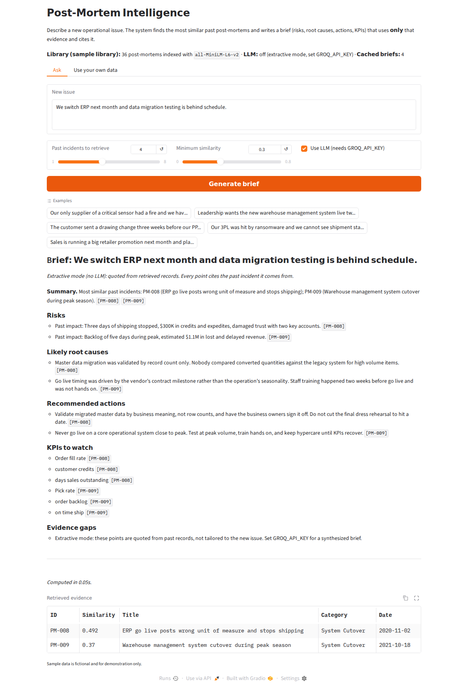
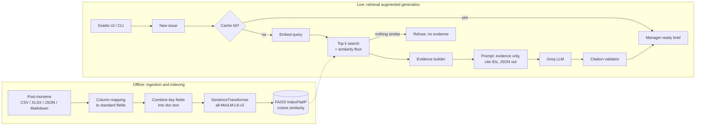

# Post-Mortem Intelligence

**Teams write a post-mortem after every failure, then almost never read it again. So the same failure gets relearned at full cost.**

This tool turns a library of past post-mortems into decision support. You describe a new issue in plain language. The system finds the most similar past incidents and writes a short, manager-ready brief covering risks, likely root causes, recommended actions and KPIs to watch. The brief uses **only** the retrieved incidents as evidence, and every point cites the incident it came from.

It ships with a sample library of 36 supply chain, manufacturing, logistics, IT and project management post-mortems. You can swap in your own records from any industry, such as IT incidents, hospital operations or construction lessons learned, by pointing it at a CSV, Excel file or a folder of Markdown files.


*The screenshot shows extractive mode, which runs without an API key. With a Groq key, the same sections are written by an LLM from the same evidence.*

---

## How it works



| Step | What happens | Where |
|---|---|---|
| Ingest | Reads CSV, XLSX, JSON, JSONL or a folder of `.md`/`.txt` files. Maps your column names onto standard fields, and rejects duplicate or missing IDs with a clear message. | `postmortem_intel/ingest.py` |
| Index | Combines the chosen fields into one text per incident, embeds it with a SentenceTransformer model, and stores normalized vectors in a FAISS inner product index, so the score is cosine similarity. The index is saved to disk and rebuilt automatically when the data or settings change. | `postmortem_intel/index.py` |
| Retrieve | Returns the top k incidents, drops any below a minimum similarity, and drops any far weaker than the best match. If nothing clears the floor, the system says so instead of generating advice. | `postmortem_intel/engine.py` |
| Brief | Sends only the retrieved incidents to the LLM with strict rules: use the evidence only, cite IDs, ignore incidents that are not actually relevant, and list evidence gaps. The model returns JSON. | `postmortem_intel/brief.py` |
| Validate | Every returned point is checked. Citations that point at incidents that were not retrieved are removed, points left with no valid citation are dropped, and the brief reports what was removed. | `brief.validate()` |
| Cache | Finished briefs are stored in SQLite. The key includes the question, retrieval settings, the index fingerprint, the model and the prompt version, so new data or a new prompt never serves a stale answer. | `postmortem_intel/cache.py` |

**No API key? It still works.** Without `GROQ_API_KEY`, the app produces an *extractive* brief. It quotes the root cause, impact, lessons and KPIs straight from the retrieved records and labels itself as quoted rather than synthesized. If the LLM call fails (bad key, rate limit, malformed output), the app falls back to the extractive brief and says why. Fallback briefs are never cached.

---

## Quick start

Requires Python 3.10+.

```bash
git clone https://github.com/akashhalgekar/postmortem-intelligence.git
cd postmortem-intelligence
python -m venv .venv && source .venv/bin/activate
pip install -r requirements.txt

# optional, for LLM written briefs (free key at https://console.groq.com)
export GROQ_API_KEY=your_key_here

python app.py            # open http://127.0.0.1:7860
```

The first run downloads the embedding model (about 90 MB) from Hugging Face.

### Command line

```bash
python -m postmortem_intel.cli index
python -m postmortem_intel.cli ask "Our only supplier of a critical sensor had a fire and we have one week of stock left"
python -m postmortem_intel.cli ask "..." --json        # structured output for other tools
python -m postmortem_intel.cli ask "..." --no-llm      # extractive brief only
python -m postmortem_intel.cli --data data/examples/markdown ask "dock label printer failed"   # another library
```

---

## Use it with your own data

**In the app:** open the *Use your own data* tab, upload a CSV or Excel file, and check the column mapping. Common names like *Cause*, *Fix*, *Lesson* and *Summary* are matched automatically. Then build. The uploaded library is private to your browser session.

**Permanently:** edit `config.yaml`.

```yaml
data:
  path: data/my_incidents.xlsx
  columns:              # standard field: your column name
    id: Ticket
    title: Headline
    description: What happened
    root_cause: Cause
    actions_taken: Fix
    lessons_learned: Lesson
    kpis_impacted: Metrics
    date: ""            # leave blank if you don't have it
  embed_fields: [title, description, root_cause, lessons_learned]
```

Only `id` and one text field are required. For a folder of Markdown post-mortems, the file name becomes the ID, the `#` heading becomes the title, and `##` sections such as *Summary*, *Root Cause*, *Actions Taken* and *Lessons Learned* are mapped automatically. See `data/examples/`.

To change the LLM, set `llm.model` to any Groq model ID. The default is `openai/gpt-oss-120b`. To change the embedding model, set `retrieval.embedding_model` to any SentenceTransformers model, then re-run `eval/run_eval.py` and re-check the similarity thresholds.

---

## Testing and evaluation

```bash
pytest -q                  # 20 tests
python eval/run_eval.py    # retrieval quality report
```

**Tests** cover ingestion and error messages, index persistence and rebuild on data change, refusal on off-topic questions (the LLM is never called), grounding (fake citations and uncited points are removed, and the prompt contains only retrieved incidents), JSON retry and fallback, cache hits and invalidation, the CLI, and a second industry's file with different column names. The LLM is replaced by a fake client in tests so they run offline. The embedding model and FAISS are real.

**Retrieval evaluation.** There are 25 new-issue questions, written in different words from the post-mortems, each labelled with the past incidents an analyst would want surfaced. Labels were written before the retriever was run. Results with the default model are in `eval/results.txt`:

| Metric (k = 4) | Embeddings | Keyword baseline (TF-IDF) |
|---|---|---|
| Recall@4 | 0.83 | 0.79 |
| Hit@1 (best match is relevant) | 0.92 | 0.84 |
| MRR | 0.95 | 0.88 |

- **Refusal:** the best on-topic match scored at least 0.35, and six off-topic questions (recipes, sports, trivia) scored 0.123 or lower. The default floor of 0.30 kept all 25 on-topic questions and refused all 6 off-topic ones.
- **Evidence precision:** dropping matches more than 0.15 below the best one raised the share of relevant incidents sent to the LLM from 0.41 to 0.63, while recall went from 0.83 to 0.77.

Read these numbers as a sanity check, not a benchmark. The library is small, and the same person wrote the data and the labels.

---

## Known limitations

- **Paraphrase gaps with a small model.** In the evaluation, "our only vendor had a flood" did not retrieve the *sole source* incidents, because MiniLM does not link *only vendor* with *sole source* strongly enough. When the best match is weak, the brief shows a **Weak match** warning. A larger embedding model will likely do better, but that has not been measured here.
- **The LLM path was tested with a mocked client**, not against live Groq output. The validator guarantees that citations point at retrieved incidents. It cannot guarantee that the wording of each point is faithful to the incident it cites, so a human should review a brief before anyone acts on it.
- **Similarity is not causation.** A past incident that looks similar may have had a different cause. The prompt tells the model to frame points as "past incidents suggest", and every point links back to its source record.
- **Sample data is fictional.** The companies, suppliers and figures are invented for demonstration.

---

## Project structure

```
app.py                      Gradio app (Ask tab + Use your own data tab)
config.yaml                 Data path, column mapping, model and threshold settings
postmortem_intel/
  config.py                 Loads and validates config
  ingest.py                 CSV / XLSX / JSON / Markdown loaders, column mapping
  index.py                  Embeddings + FAISS index, save/load, fingerprint
  engine.py                 Retrieve, brief, cache orchestration
  brief.py                  Prompt, Groq call, citation validator, extractive mode, rendering
  cache.py                  SQLite brief cache
  cli.py                    Command line interface
data/
  sample_postmortems.csv    36 fictional post-mortems (built by build_sample_data.py)
  examples/                 A second industry (IT incidents) and a Markdown example
eval/
  queries.yaml              25 labelled evaluation questions
  run_eval.py               Retrieval metrics vs keyword baseline, threshold check
  results.txt               Latest results
tests/test_pipeline.py      20 tests
```

## Why I built it

I first built a version of this in early 2026 and shared it on LinkedIn to get feedback from people in operations, project management and applied AI. This repository is a clean rebuild with the parts a real team would need: configurable data, a refusal path, citation checks, a fallback without an API key, tests and a measured retrieval evaluation.

The core idea: the value of AI in operations is reusing what the organization already knows, not generating something new.

## License

MIT
